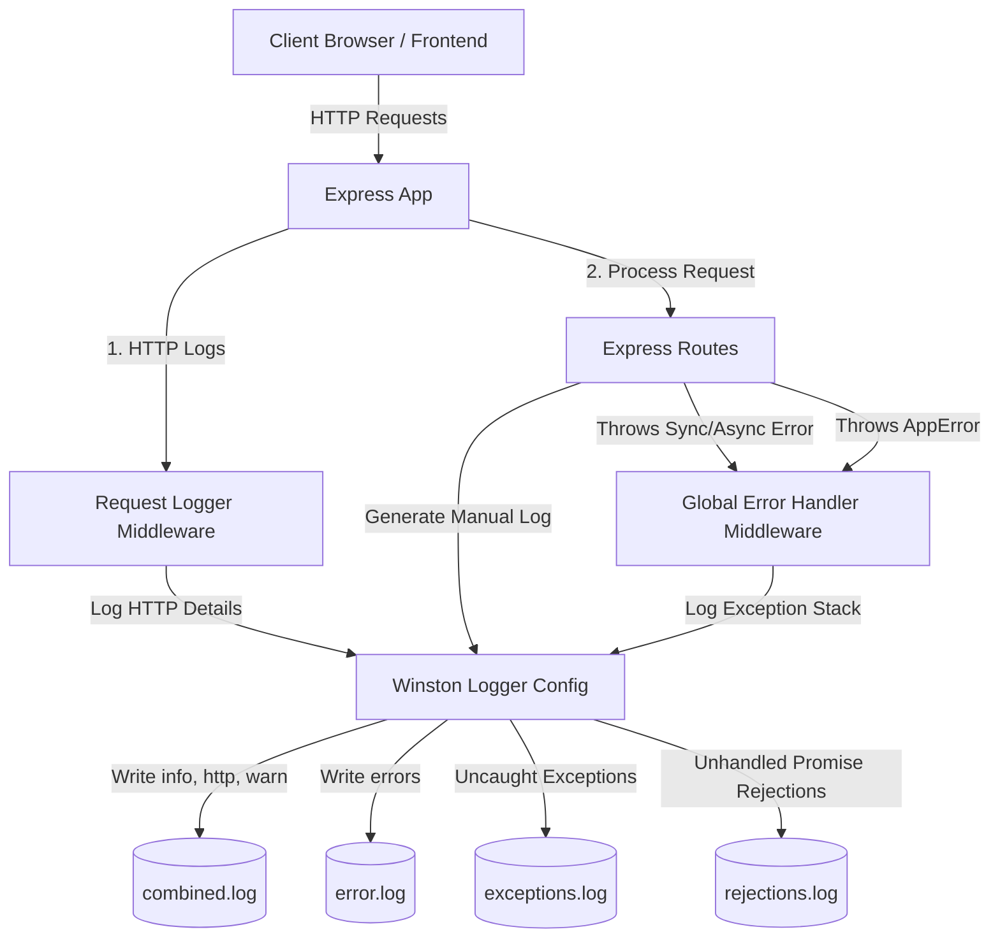

# Day 27 Walkthrough: Winston Logging & Global Error Handling in Node.js

This document provides a detailed walkthrough of the implementation for **Day 27: Error Logging & Global Error Handling**. This implementation leverages **Winston** for robust logging to both the console (colorized and human-readable) and file system (structured JSON logs), and configures a **Global Error Handler** in Express to catch and log all error flows.

---

## 📸 Control Center Dashboard

Below is a screenshot of the premium, dark-mode glassmorphic control center dashboard built for real-time interaction and inspection of Winston logging and global error interceptors:


---

## 🛠️ Architecture & Components

The application is structured cleanly into modular components:



### 1. Winston Logger Setup (`src/config/logger.js`)
Handles target transports, styling, and file rotations.
- **Console Transport**: Outputs highly readable colorized log lines formatted with custom templates.
- **File Transports**: Saves structured JSON log payloads containing timestamps, levels, stack traces, and request metadata into specific logs under `logs/`.
- **Exception/Rejection Transports**: Automatically captures and records out-of-Express-context errors.

### 2. Custom AppError Class (`src/utils/appError.js`)
Extends JavaScript's built-in `Error` class to cleanly distinguish between:
- **Operational Errors**: Expected errors (e.g. 404 Route Not Found, 400 Bad Request, Validation failed) which are resolved gracefully.
- **Programming Errors**: Unhandled/unexpected crashes (e.g. `ReferenceError: x is not defined`) which leak no raw details in Production.

### 3. Request Logger Middleware (`src/middleware/requestLogger.js`)
Tracks the lifetime of every HTTP request, measuring execution time in milliseconds and automatically categorizing logs:
- `statusCode >= 500` ➔ `logger.error`
- `statusCode >= 400` ➔ `logger.warn`
- `statusCode < 400` ➔ `logger.http`

### 4. Global Error Handler (`src/middleware/errorHandler.js`)
Catches any runtime errors passed to `next(err)`:
- Captures details, filters sensitive parameters (like passwords/tokens), and logs them using Winston.
- Distinguishes between Development (returns stack traces) and Production environments (safe messages).

---

## 💻 Code Reference

### Winston Logger Configuration
```javascript
const winston = require('winston');
const path = require('path');

const logger = winston.createLogger({
  level: process.env.LOG_LEVEL || 'debug',
  levels: { error: 0, warn: 1, info: 2, http: 3, debug: 4 },
  format: winston.format.combine(
    winston.format.timestamp({ format: 'YYYY-MM-DD HH:mm:ss:ms' }),
    winston.format.errors({ stack: true }),
    winston.format.json()
  ),
  transports: [
    new winston.transports.File({ filename: 'logs/error.log', level: 'error' }),
    new winston.transports.File({ filename: 'logs/combined.log' }),
  ]
});
```

### Express Global Error Interceptor
```javascript
const errorHandler = (err, req, res, next) => {
  err.statusCode = err.statusCode || 500;
  
  logger.error(`${err.statusCode} - ${err.message} - ${req.originalUrl} - ${req.method}`, {
    stack: err.stack,
    metadata: { url: req.originalUrl, method: req.method, ip: req.ip }
  });

  res.status(err.statusCode).json({
    status: err.status || 'error',
    message: err.message,
    ...(process.env.NODE_ENV !== 'production' && { stack: err.stack })
  });
};
```

---

## 🚀 How to Run and Test

1. **Install Dependencies**:
   ```bash
   npm install
   ```
2. **Start the Development Server**:
   ```bash
   npm run dev
   ```
   *The server runs on http://localhost:5000.*
3. **Open the Dashboard**:
   Go to [http://localhost:5000/index.html](http://localhost:5000/index.html) to interact with the Log Engine:
   - Click buttons to generate custom level logs.
   - Simulate 400 Operational Errors, 500 Synchronous and Asynchronous Errors, Unhandled Promise Rejections, and Uncaught Exceptions.
   - Expand logs in the real-time terminal log viewer to view detailed JSON properties and stack traces.
